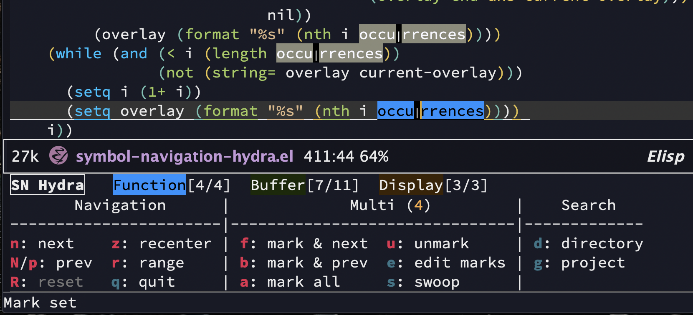
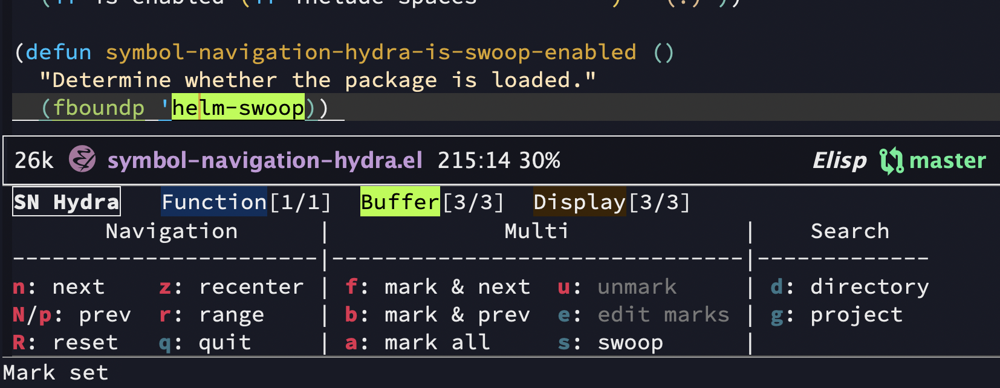

# Symbol Navigation Hydra

[](https://melpa.org/#/symbol-navigation-hydra)

This package is an Emacs [hydra](https://github.com/abo-abo/hydra) that augments existing Emacs navigation and editing functionality by adding awareness of symbols and configuration of the range of focus for these operations. Its functionality can be partitioned into three categories:

1. navigation
2. multiple cursors / swooping
3. searching in a directory/project





There are three available ranges:

1. The function surrounding your cursor
2. The entire buffer
3. The visible portion of the buffer

With your cursor anywhere on a symbol (no need to select it), bring up the hydra, and you have a number of pieces of functionality available:

* Navigation
    * _n_ and _p_ move the cursor to the next and previous instance of the symbol, respectively
                  For example, you may define multiple variables with the same name across multiple
                  functions. They accept a prefix argument (e.g. C-u 3)
    * _R_ moves the cursor back to where it was when you activated the hydra.
    * _r_ selects another range. There are only three, so at most you need to hit it twice.
    * _z_and _l_ vertically centers the current line. This is like the Emacs command `recenter-top-bottom` -
          usually `C-l` - but within the hydra.
    * _i_ moves the cursor to the `i`th occurrence of the symbol. Note that `i` is 1-indexed, since that is the format in the overlay counts (e.g. the [3/7] marker at the top of the hydra)
    * _1_ moves the cursor to the 1st occurrence of the symbol, and centers the cursor in the window. See _i_ for reasoning on why this is 1-indexed.
* Multi
    * _f_ drops a cursor at the current location, and moves forward to the next occurrence of the symbol
          within the range. After this, you will have at least two cursors active. It accepts a prefix argument (e.g. C-u 3)
    * _b_ drops a cursor at the current location, and moves backward to the previous occurrence of the symbol
          within the range. After this, you will have at least two cursors active. It accepts a prefix argument (e.g. C-u 3)
    * _e_ exits the hydra and preserves all cursors. This is the way to exit when they want to exit the
          hydra and start editing your buffer again, but with the multiple cursors active. All other ways
          of exiting the hydra will clear the cursors.
    * _a_ places cursors at every instance of the symbol in the range.
    * _s_ activates [Helm Swoop](https://github.com/emacsorphanage/helm-swoop), with the current symbol
          as the search query. This is not range-aware.
* Search
    * _d_ and _g_ search for the symbol in the current directory and Projectile project, respectively.
                  This is not a function of the current range.

## Setup

### Installing (for most Emacs distributions)

This package is available via MELPA (https://melpa.org/#/symbol-navigation-hydra), via the following command:

```
M-x package-install symbol-navigation-hydra
```

Alternately, clone a) this repo b) [hydra](https://github.com/abo-abo/hydra) c) [auto-highlight-symbol](https://github.com/jcs-elpa/auto-highlight-symbol) d) [multiple-cursors](https://github.com/magnars/multiple-cursors.el) and put them all in your Emacs `load-path`:

``` elisp
(add-to-list 'load-path "~/path/to/cloned/repo/")
...
```

### Installing (for Doom)

```elisp
;; in packages.el
(package! symbol-navigation-hydra)
```

### Installing (additional functionality)

By default, only the navigation functionality is enabled. The remaining heads are disabled so as to not bloat the user's setup by installing a bunch of dependencies when installing this package. The following packages are optional, but enable features that are disabled otherwise:

* [`helm-swoop`](https://github.com/emacsorphanage/helm-swoop)
* [`helm-ag`](https://github.com/emacsorphanage/helm-ag)
    * [The Silver Searcher](https://github.com/ggreer/the_silver_searcher)
* [`projectile`](https://github.com/bbatsov/projectile)

### Activating

```elisp
;; in your .emacs.d/init.el file or equivalent
(require 'symbol-navigation-hydra)

;; if you're not using Doom, you also need the following
(require 'hydra)
(require 'auto-highlight-symbol)
(require 'multiple-cursors)
```

## Recommended Settings

```elisp
;; You'll want a keystroke for bringing up the hydra.
(global-set-key (kbd "something") 'symbol-navigation-hydra-engage-hydra)

;; The hydra is intended for navigation only in the current window.
(setq-default ahs-highlight-all-windows nil)

;; Highlight only while the hydra is active; not upon other circumstances.
(setq-default ahs-highlight-upon-window-switch nil)
(setq-default ahs-idle-interval 999999999.0)

;; Be case-sensitive, since you are probably using this for code.
(setq-default ahs-case-fold-search nil)

;; Personal preference -- set the default "range" of operation to be the entire buffer.
(setq-default ahs-default-range 'ahs-range-whole-buffer)

;; Same defaults for multiple cursor behavior
(setq-default mc/always-repeat-command t)
(setq-default mc/always-run-for-all t)

;; You might want this so SN Hydra mutliple cursors can update
;; print-statements / doc-strings
(setq-default ahs-inhibit-face-list (delete 'font-lock-string-face ahs-inhibit-face-list))
(setq-default ahs-inhibit-face-list (delete 'font-lock-doc-face ahs-inhibit-face-list))

;; Many - but not all - languages are supported by default. You'll probably get pretty good
;; behavior by just opting one in if it's not already there.
(push 'haskell-mode ahs-modes) ;; e.g. if you want Haskell
```

If this is your first time using an Emacs hydra, you might want to set

```elisp
;; Once you know what the colors mean, you probably won't need this anymore.
(setq-default ahs-hydra-display-legend t)
```

You may also wish to customize some other variables from the [Auto Highlight Symbol package](https://github.com/jcs-elpa/auto-highlight-symbol) itself.

## Differences with the Spacemacs AHS Transient State

This package was inspired by the [Spacemacs AHS Transient State](https://develop.spacemacs.org/doc/DOCUMENTATION.html#highlight-current-symbol) :)

The most prominent difference is simultaneous display of all three overlay counts, instead of just one.

Also, this hydra supports multiple cursors functionality. The `iedit` hydra head has been replaced with an implementation based on the widely used `multiple-cursors` library.

The _d_ and _D_ heads are removed since the implementation (which used the underlying Auto Highlight Symbol package) wasn't very accurate. The _b_ (open buffers search) head is not supported since I didn't find it useful.

## Licence

This program is free software: you can redistribute it and/or modify it under the terms of the GNU General Public License as published by the Free Software Foundation, either version 3 of the License, or (at your option) any later version.

This program is distributed in the hope that it will be useful, but WITHOUT ANY WARRANTY; without even the implied warranty of MERCHANTABILITY or FITNESS FOR A PARTICULAR PURPOSE. See the GNU General Public License for more details.

You should have received a copy of the GNU General Public License along with this program. If not, see http://www.gnu.org/licenses/.

## Other

I'd love to hear your feedback. Raise an Github issue here and I'll respond promptly.

Many thanks to [thomasjm](http://github.com/thomasjm) for contributing ideas, code, and debugging to this package.
